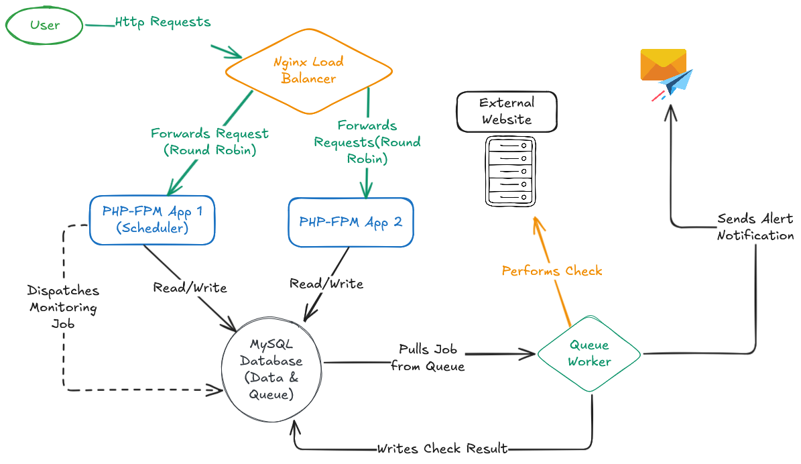

<div align="center">
  
  <h1>Mini-Netumo</h1>
  <p><strong>A powerful, open-source, and scalable website monitoring solution.</strong></p>
  <p>Built with ❤️ by a collaborative team.</p>
</div>

---

**Mini-Netumo** is a robust, open-source monitoring solution designed to provide real-time insights into the health of your web services. It empowers users to proactively track website uptime and SSL certificate status through a clean, intuitive dashboard.

Born from a need for a reliable and scalable monitoring tool, Mini-Netumo is built on a modern, high-availability architecture using Docker, making it perfect for developers, system administrators, and businesses who demand high reliability from their own services. Our design philosophy prioritizes **stability, simplicity, and low operational overhead** - delivering essential monitoring capabilities without the complexity and cost of enterprise-grade platforms.

It can be viewed at http://185.181.11.156/ (Note: Demo link is currently inactive due to cloud hosting trial expiration)

## Screenshots

### Landing Page & User Interface

<div align="center">
  
  <p><em>Welcome to Mini-Netumo - Clean and professional landing page</em></p>
</div>

<div align="center">
  
  <p><em>Feature overview and value proposition</em></p>
</div>

### Authentication

<div align="center">
  
  <p><em>Simple and secure user registration process</em></p>
</div>

<div align="center">
  
  <p><em>Clean login interface</em></p>
</div>

### Main Dashboard

<div align="center">
  
  <p><em>Comprehensive dashboard showing targets and alerts at a glance</em></p>
</div>

## Core Functionality

Mini-Netumo provides a comprehensive suite of monitoring tools. Here's a more detailed look at how it keeps you informed:

-   **Target Management**: Easily add, edit, or remove any number of websites or endpoints you wish to monitor. The system accepts any valid URL (e.g., `https://my-api.com`, `http://my-blog.org`). Each target is stored with its own monitoring history and settings.

    <div align="center">
      
      <p><em>Targets index page showing all monitored websites with their current status</em></p>
    </div>

    <div align="center">
      
      <p><em>Simple form to add new monitoring targets</em></p>
    </div>

-   **Automated Health Checks**: Once a target is added, Mini-Netumo's automated scheduler gets to work. Leveraging Laravel's built-in scheduler, it queues up jobs to check every single target every five minutes. These jobs are processed asynchronously by a dedicated background worker, ensuring the user interface remains fast and responsive, even with hundreds of targets.

-   **Uptime Monitoring**: The system performs an HTTP `GET` request to the target URL. A successful check is defined by a `2xx` or `3xx` status code, indicating the service is available. Any other status code or a connection timeout is flagged as downtime. This status, along with the response time, is logged to provide a historical record of availability.

-   **SSL Certificate Monitoring**: To prevent security warnings and loss of user trust, Mini-Netumo automatically checks the SSL certificates of your `https` targets. It fetches the certificate and verifies two key aspects: its overall validity (is it trusted and correctly installed?) and its expiration date. Alerts are triggered for invalid certificates and for valid certificates that are nearing their expiration date (configurable via `.env`).

-   **Historical Data & Insights**: Dive into the history of any target to see a detailed log of its uptime and SSL checks. This data is invaluable for performance analysis, diagnosing recurring issues, and generating SLA reports.

    <div align="center">
      
      <p><em>Detailed target view showing monitoring history and current status</em></p>
    </div>

-   **Manual Checks**: Don't want to wait for the next five-minute cycle? You can trigger a manual check for any target at any time. This check bypasses the queue and is executed immediately, giving you instant feedback on a target's current status.

-   **Email Notifications**: When an alert is triggered (e.g., a site goes down or an SSL certificate is about to expire), Mini-Netumo automatically sends clear, direct email notifications via SMTP to your registered address. The system uses universal SMTP standards, making it compatible with any email provider without complex API integrations.

    <div align="center">
      
      <p><em>Alert detail view showing incident information and status changes</em></p>
    </div>

## System Architecture

This project isn't just a Laravel application; it's a scalable, containerized system designed for high availability and resilience. We use Docker and Docker Compose to orchestrate a multi-container environment that separates concerns and eliminates single points of failure.

The `docker-compose.yml` file defines the following key services:

-   **`nginx` (Load Balancer & Web Server)**: Acts as the single entry point for all web traffic. Built from our `docker/nginx/Dockerfile`, it serves static assets (CSS, JS) directly for maximum speed and acts as a reverse proxy, load-balancing incoming dynamic requests across multiple backend application containers.

-   **`app` (PHP-FPM Containers)**: The core Laravel application runs in multiple, identical PHP-FPM containers (`app1`, `app2`). Built from `docker/php/Dockerfile`, this cluster of app servers allows the system to handle more concurrent users and ensures that if one container fails, the others can continue processing requests, preventing service interruption.

-   **`worker` (Queue Worker)**: A dedicated container that runs the Laravel Queue Worker (`php artisan queue:work`). All long-running tasks, such as performing the actual site monitoring checks, are dispatched as jobs to a queue (using the database driver by default). This worker processes the queue in the background, ensuring that the user-facing `app` containers are never blocked and remain highly responsive.

-   **`db` (MySQL Database)**: The MySQL database runs in its own container, with a persistent Docker volume to ensure data is not lost when containers are restarted. The `app` and `worker` containers connect to this database.

### The Lifecycle of a Monitoring Job

1.  **Scheduling**: The Laravel Scheduler, running on a single `app` container (`app1`), executes `php artisan schedule:run` every minute.
2.  **Dispatching**: Every five minutes, the scheduler dispatches the `MonitorSites` command, which fetches all active targets from the database and dispatches an individual check job for each one onto the queue.
3.  **Processing**: The dedicated `worker` container is constantly polling the queue. It picks up a check job and executes it.
4.  **Execution**: The worker performs the HTTP and/or SSL check against the target URL over the internet.
5.  **Recording**: The result of the check (status, response time, SSL info) is saved to the `status_logs` and `ssl_checks` tables in the database. If the status has changed (e.g., from up to down), an `alert` record is created or updated.

### The Lifecycle of a User Request

1.  **Request**: A user's browser sends a request, for instance, to load the dashboard.
2.  **Load Balancing**: The `nginx` container receives the request and forwards it to one of the available `app` containers (e.g., `app2`) in a round-robin fashion.
3.  **Application Logic**: The Laravel application in `app2` processes the request. It fetches the required data (targets, alerts, etc.) from the `db` container.
4.  **Response**: The application renders the Blade view into HTML and sends the response back to `nginx`, which in turn sends it to the user's browser.

### Architectural Diagram



This diagram illustrates the flow of a user request and a background monitoring job:

## Configuration

The application's behavior can be customized via environment variables in the `.env` file.

| Variable                    | Default            | Description                                                                                    |
| --------------------------- | ------------------ | ---------------------------------------------------------------------------------------------- |
| `APP_URL`                   | `http://localhost` | The canonical URL of your application.                                                         |
| `DB_CONNECTION`             | `mysql`            | The database connection to use.                                                                |
| `QUEUE_CONNECTION`          | `database`         | The driver for the queue system. `database` is reliable and simple. `redis` is also an option. |
| `SSL_EXPIRY_THRESHOLD_DAYS` | `14`               | The number of days before an SSL certificate's expiration to trigger a warning alert.          |
| `MAIL_MAILER`               | `smtp`             | Email driver for notifications. Configure with your SMTP provider credentials.                 |

### Email Configuration

To enable email notifications, configure these additional environment variables:

```env
MAIL_MAILER=smtp
MAIL_HOST=your-smtp-server.com
MAIL_PORT=587
MAIL_USERNAME=your-email@domain.com
MAIL_PASSWORD=your-password
MAIL_ENCRYPTION=tls
MAIL_FROM_ADDRESS=your-email@domain.com
MAIL_FROM_NAME="Mini-Netumo Monitoring"
```

## Tech Stack

This project is built with a modern tech stack, ensuring performance and scalability.

-   **Backend**: PHP 8.2, Laravel 12 (utilizing Queues, Scheduler, Eloquent ORM), MySQL 8.0
-   **Web Server**: Nginx (acting as a load balancer and reverse proxy)
-   **Frontend**: Tailwind CSS, Alpine.js, Blade Templates
-   **Containerization**: Docker & Docker Compose
-   **Notifications**: SMTP-based email alerts (universal compatibility)

## Design Philosophy

Our architectural decisions are guided by three core principles:

-   **Stability Over Complexity**: We chose proven, battle-tested technologies like MySQL and SMTP over newer alternatives to ensure reliable operation
-   **Simplicity in Deployment**: Single-VM deployment with Docker Compose eliminates cloud complexity while maintaining scalability
-   **Low Operational Overhead**: Database-driven queues and server-side rendering reduce dependencies and maintenance burden

## Getting Started

To get a local copy up and running, follow these simple steps.

### Prerequisites

-   Docker
-   Docker Compose

### Installation

1.  **Clone the repo**
    ```sh
    git clone https://github.com/Buberwa-J/Mini-Netumo.git
    cd mini-netumo
    ```
2.  **Setup Environment File**

    Copy the example environment file. The application is configured to work out-of-the-box with the Docker setup.

    ```sh
    cp .env.example .env
    ```

    You will also need to generate an application key.

    ```sh
    docker-compose run --rm app1 php artisan key:generate
    ```

3.  **Build and run the Docker containers**
    ```sh
    docker-compose up -d --build
    ```
4.  **Install Composer dependencies**
    ```sh
    docker-compose exec app1 composer install
    ```
5.  **Run database migrations**
    The primary application container (`app1`) is set up to run migrations automatically on startup. You can also run them manually:
    ```sh
    docker-compose exec app1 php artisan migrate
    ```
6.  **Install NPM dependencies and build assets**
    ```sh
    docker-compose exec app1 npm install
    docker-compose exec app1 npm run build
    ```

You should now be able to access the application at [http://localhost](http://localhost).

### Troubleshooting

-   If containers fail to start, check the logs for errors: `docker-compose logs -f app1` or `docker-compose logs -f nginx`.
-   Permission errors in the `storage` or `bootstrap/cache` directories can often be fixed by running `docker-compose exec app1 chown -R www-data:www-data storage bootstrap/cache`.

## Roadmap

Here are some of the features and improvements we are planning:

-   **Advanced Notifications**: Integration with services like Slack, Telegram, and webhooks for richer alert delivery
-   **Performance Graphing**: Visualize response time data with historical graphs to spot performance degradation
-   **Advanced Check Types**:
    -   TCP Port Monitoring (e.g., check if a database port is open)
    -   DNS record validation
    -   Custom HTTP headers and authentication
-   **Data Management**: Automated log pruning and retention policies to manage storage growth
-   **Enhanced Reliability**: Distributed scheduling to eliminate single points of failure

## Security & Reliability

Mini-Netumo implements several measures to ensure secure and reliable operation:

-   **Laravel Security Best Practices**: Built-in protection against SQL injection, XSS, and CSRF attacks
-   **Containerized Isolation**: Each service runs in its own container with minimal attack surface
-   **High Availability Architecture**: Load-balanced application containers ensure continued operation if one fails
-   **Automated Recovery**: Queue workers automatically restart on failure to maintain monitoring continuity

For production deployment, ensure:

-   Secure `.env` file permissions (600 or stricter)
-   Regular security updates for dependencies
-   Proper firewall configuration limiting external access

## User Journey

Mini-Netumo is designed for an intuitive workflow that guides you from setup to proactive issue resolution:

1. **Quick Onboarding**: Register an account and add your first monitoring target through a clean, minimalist interface
2. **Automated Peace of Mind**: Within 5 minutes, see your first monitoring results as the system begins 24/7 automated checks
3. **Instant Verification**: Use the "Check Now" feature for immediate feedback after deployments or changes
4. **Proactive Alerting**: Receive instant email notifications when issues occur, with clear status indicators on your dashboard
5. **Easy Investigation**: Access detailed historical logs to pinpoint exactly when issues began and track resolution
6. **Automatic Recovery**: Watch alerts automatically resolve when services come back online, with complete incident history preserved

## Contributing

This project was built by a team of developers. Contributions, issues, and feature requests are welcome!

## License

This project is open-sourced under the MIT license.
